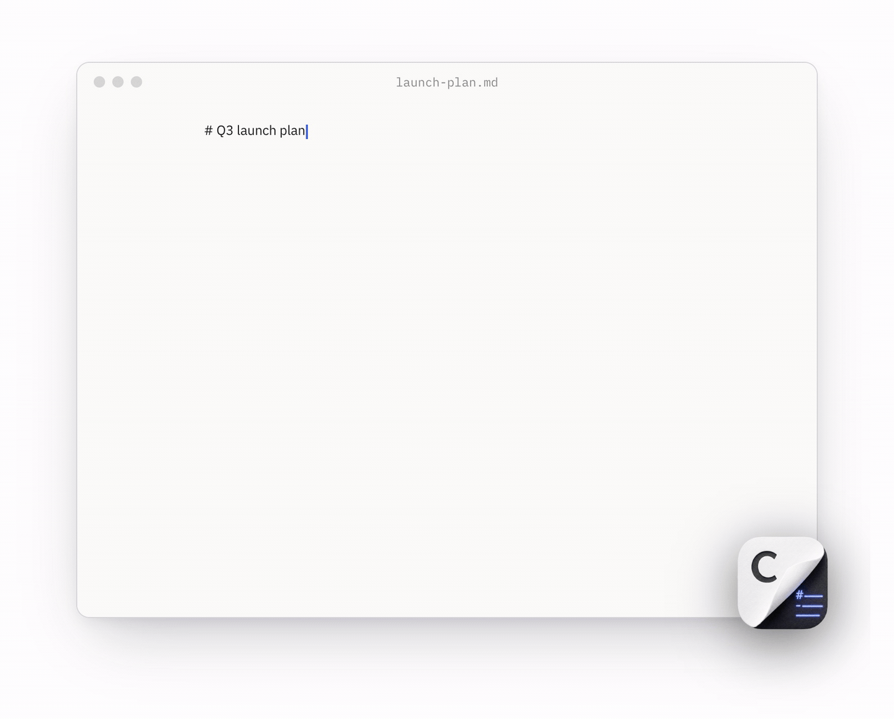
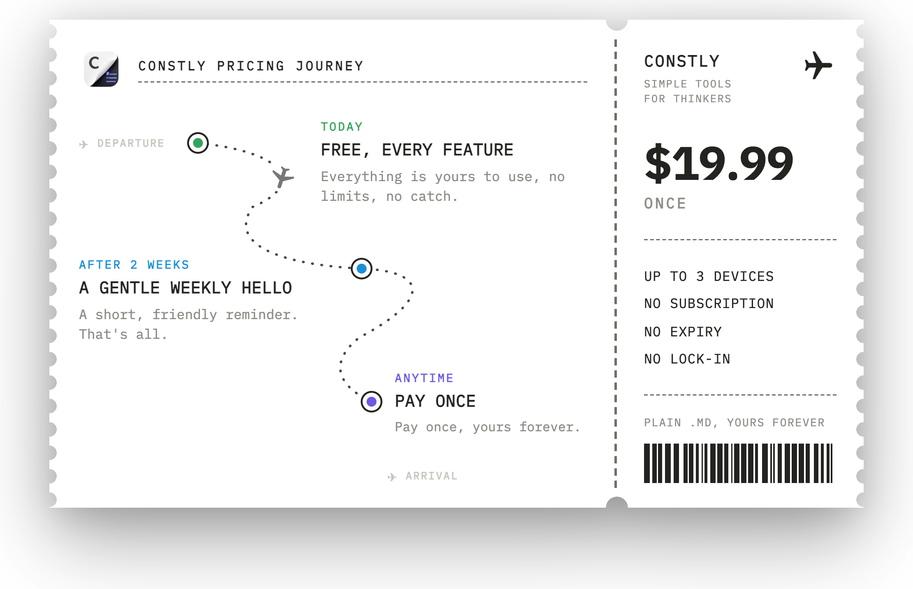

<p align="center">
  
</p>

<h1 align="center">Constly</h1>

<p align="center">
  <b>A WYSIWYG markdown editor that renders the marks away as you type.</b><br>
  Local-first, private, plain <code>.md</code>. Native builds for macOS, Windows, and Linux.
</p>

<p align="center">
  <a href="https://constly.com/download"></a>
  
  
  <a href="https://github.com/RunTheWall/homebrew-tap"></a>
  <a href="https://github.com/RunTheWall/constly-app/stargazers"></a>
</p>

<p align="center">
  <b>Runs on</b>
  
  
  
</p>

<p align="center">
  <a href="https://constly.com/download"><b>Download</b></a> &nbsp;·&nbsp;
  <a href="https://runthewall.github.io/constly-app/">Release notes</a> &nbsp;·&nbsp;
  <a href="ROADMAP.md">Roadmap</a> &nbsp;·&nbsp;
  <a href="https://constly.com/blog">Blog</a>
</p>

---

Type `# a heading`, `**bold**`, a table, a code fence, and each one renders in
place, the raw marks melting away as you go. Your file on disk stays plain
markdown, byte for byte. No web app in a wrapper, no proprietary format, no
account.

## Install

| Platform | How |
|---|---|
| **macOS** | [Download the DMG](https://constly.com/download) (Apple Silicon or Intel), or install with Homebrew (below) |
| **Windows** | [Download the installer](https://constly.com/download) (signed, 10 and 11, 64-bit) |
| **Linux** | [Download](https://constly.com/download) the `.deb`, `.rpm`, or tarball |

On macOS, install and stay current through Homebrew:

```sh
brew install --cask runthewall/tap/constly
```

Or tap first, then install:

```sh
brew tap runthewall/tap
brew install --cask constly
```

The cask points at the signed, notarized builds and uses Constly's own updater, so
it keeps itself current.

## Pricing

<p align="center">
  
</p>

Constly is free to use for as long as you need. Every feature is unlocked, nothing
expires, and exports never carry a watermark. No account, no card. After two weeks
a gentle dialog asks you to buy, and that dialog is the whole business model.

To retire the reminder and back a tiny studio, a one-time license is **$19.99 USD**
(plus applicable tax). No subscription, ever, and one license covers every platform
you use. Need several seats? Volume licenses are available on request.

See the full details on [constly.com](https://constly.com/#pricing).

## This repository

Constly is a closed-source app: there is no source code here and no builds to
download in this repo. Every release lives on
[constly.com](https://constly.com/download), signed and notarized. This is the
community home, where you:

- **Report bugs and request features** in [Issues](https://github.com/RunTheWall/constly-app/issues/new/choose)
- **Follow the [roadmap](ROADMAP.md)** and upvote what matters to you
- **Read the [release notes](CHANGELOG.md)**, also browsable at [runthewall.github.io/constly-app](https://runthewall.github.io/constly-app/)

To report a security vulnerability, see the [security policy](SECURITY.md).

---

<p align="center">
  Built with care by <a href="https://github.com/RunTheWall">Run The Wall Pty Ltd</a>.<br>
  <a href="https://constly.com">constly.com</a>
</p>
